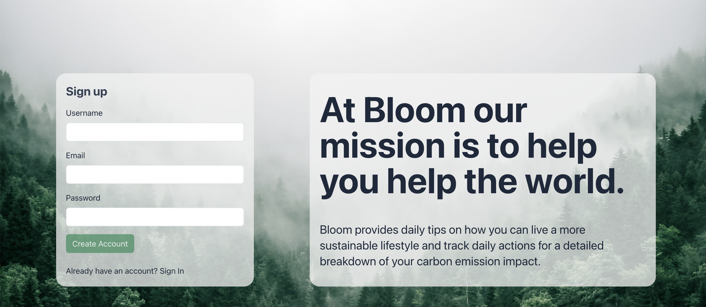
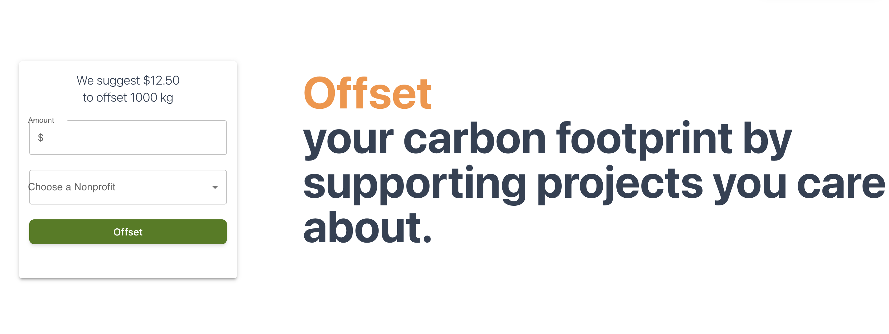

# Bloom

## Table of contents
* [What is Bloom?](#what-is-bloom)
* [Live Site](#live-site)
* [API/Information Sources](#api-sources)
* [Built With](#built-with)
* [Screenshots](#screenshots)
* [Team](#team)

## What is Bloom? 
Bloom is a site dedicated to taking the guesswork out of reducing your individual carbon footprint. It acts as an all-in-one resource to: 
* Calculating your carbon footprint based on individual or combined actions; 
* Comparing your footprint to averages; making voluntary donations to environmental organizations based on balancing your carbon emissions; 
* Having quick access to the current air quality and temperature in your area; 
* Learning more about how you can lessen your own environmental impact via infographics and up-to-date news articles; 
* And digging deeper into specific inqueries via our OpenAI-powered chatbot for all things climate change related, Bloom GPT. 

## Live Site 
Bloom is deployed and live at https://bloomv1.herokuapp.com/

## API/Information Sources 
* Current air quality/temperature: AirVisual (https://www.iqair.com/)
* Carbon emissions for calculator: Carbon Independent (https://carbonindependent.org/), Your Life In Data (https://www.yourlifeindata.com/)
News articles: News API (https://newsapi.org/)

## Built With 
* 
* 
* 
* 
* 
* 
* 
* 
* 

## Screenshots 

## Team 
* Jorgen Paul ([@JpBaer](https://github.com/JpBaer))
* Melissa Vaughn ([@Meljska-Fawn](https://github.com/Meljska-Fawn))
* Brandon Ruano ([@bruano95](https://github.com/bruano95))
* Andrea Ginn ([@andreaginn](https://github.com/andreaginn))

